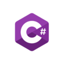

# ProgiSuli

Ez a projekt a középiskolai programozási tananyagok gyakorlásához készült. Az oldal különböző programozási nyelveket és technológiákat mutat be, mint például Python, C#, HTML és CSS.

## Fájlok

### index.html

Ez a főoldal, amely bemutatja a különböző programozási nyelveket és technológiákat. Az oldal tartalmaz linkeket a Python, C# és Web (HTML és CSS) oldalakra.

```html
<!DOCTYPE html>
<html lang="hu">
<head>
    <meta charset="UTF-8">
    <meta name="viewport" content="width=device-width, initial-scale=1.0">
    <link rel="stylesheet" href="style.css">
    <link rel="stylesheet" href="style.js">
    <link rel="icon" type="image/x-icon" href="png/PS.png">
    <title>ProgiSuli</title>
</head>
<body>
    <ul>
        <li><a href="python.html">Python</a></li>
        <li><a href="csharp.html">C#</a></li>
        <li><a href="index.html"></a></li>
        <li><a href="web.html">Web</a></li>
        <li><a href="index.html">Főoldal</a></li>
      </ul>
<hr>
    <div class="header">
        <h1>Programozás</h1>
    </div>

<div class="row">
    <div class="column">
        
        Python
        <hr>
        <p>Python...</p>
        <hr>
        <a href="python.html">Katt ide!</a>
    </div>
    <div class="column">
        
        C#
        <hr>
        <p>C#...</p>
        <hr>
        <a href="csharp.html">Katt ide!</a>
    </div>
    <div class="column">
        
        Web
        <hr>
        <p>Web...</p>
        <hr>
        <a href="web.html">Katt ide!</a>
    </div>
</div>

<hr>

    <div class="footer">
        <h3 class="uk-card-title"><b>Információ</b></h3><hr><p>Ezen az oldalon megtalálhatod, a középiskolai tananyagokat programozás gyakorlásához. Próbálkoztam a legigényesebben megoldani, hogy te is el tudj kezdeni tanulni programozni. Az oldalt megtalálhatod a <span uk-icon="icon: github-alt"></span><a href="https://github.com/MagyarMark/ProgiSuli">Github</a> oldalon is. Amennyiben bármilyen kérdésed lenne, küldj egy e-mailt erre a címre:<strong><em><mark> progisuli.info@gmail.com</mark></em></strong></p>
    </div>

</body>
</html>
```

### style.css

Ez a stíluslap határozza meg az oldal megjelenését. Tartalmazza a különböző elemek stílusait, mint például a háttérszínek, betűtípusok, animációk és elrendezések.

```css
body {
    background-color: black;
    background: linear-gradient(180deg, white);
    background-size: 200% 200%;
    margin: 0;
    padding: 0;
    box-sizing: border-box;
    font-family: 'Roboto', sans-serif;
    transition: background 0.1s ease-in-out;
}

ul {
    list-style-type: none;
    margin: 0;
    padding: 0;
    overflow: hidden;
    background-color: #000000;
    text-align: center;
    display: flex;
    justify-content: center;
    flex-wrap: wrap;
}

li {
    display: inline-block;
}

li a {
    display: block;
    color: #00F5D4;
    text-align: center;
    padding: 14px 16px;
    text-decoration: none;
    margin-top: 20px;
    font-weight: bold;
    transition: 0.3s ease-in-out;
    text-shadow: 0 0 5px #00F5D4, 0 0 10px #00F5D4;
}

li a:hover {
    color: #000000;
    box-shadow: 0 0 20px #00F5D4,
                0 0 40px #FF007F,
                0 0 60px #2A0E61;
    transition: all 0.3s ease-in-out;
}

.header {
    background: linear-gradient(45deg, #000000, #1c1c1c);
    width: 90%;
    max-width: 1200px;
    text-align: center;
    margin: 20px auto;
    padding: 20px;
    animation: colorChange 5s infinite;
    font-family: 'Roboto', sans-serif;
    font-size: clamp(16px, 5vw, 48px);
    font-weight: bold;
    text-transform: uppercase;
    border-radius: 15px;
    box-shadow: 0 0 20px #00F5D4,
                0 0 40px #FF007F,
                0 0 60px #2A0E61;
    text-shadow: 2px 2px 4px #00F5D4,
                -2px -2px 4px #FF007F;
    transition: all 0.3s ease-in-out;
}

@keyframes colorChange {
    0% { color: #00F5D4; }
    25% { color: #FF007F; }
    50% { color: #2A0E61; }
    75% { color: #00F5D4; }
    100% { color: #FF007F; }
}

.row {
    display: flex;
    justify-content: space-between;
    flex-wrap: wrap;
    padding: 25px 20px;
}

.column {
    background: linear-gradient(45deg, #000000, #1c1c1c);
    width: 100%;
    max-width: 450px;
    margin: 25px auto;
    text-align: center;
    padding: 5px;
    font-family: 'Roboto', sans-serif;
    font-size: clamp(24px, 4vw, 48px);
    font-weight: bold;
    color: white;
    text-transform: uppercase;
    border-radius: 15px;
    box-shadow: 0 0 20px #00F5D4,
                0 0 40px #FF007F,
                0 0 60px #2A0E61;
    text-shadow: 2px 2px 4px #00F5D4,
                -2px -2px 4px #FF007F;
    transition: all 0.3s ease-in-out;
}

.column1 {
    background: linear-gradient(45deg, #000000, #1c1c1c);
    width: 100%;
    max-width: 750px;
    margin: 25px auto;
    padding: 5px;
    font-family: 'Roboto', sans-serif;
    font-size: clamp(24px, 4vw, 48px);
    font-weight: bold;
    color: white;
    text-transform: uppercase;
    border-radius: 15px;
    box-shadow: 0 0 20px #00F5D4,
                0 0 40px #FF007F,
                0 0 60px #2A0E61;
    text-shadow: 2px 2px 4px #00F5D4,
                -2px -2px 4px #FF007F;
    transition: all 0.3s ease-in-out;
}

.column1 h1{
    text-align: center;
    font-size: clamp(24px, 4vw, 48px);
}

.column1 p{
    font-size: 20px;
    color: white;
    text-shadow: 0 0 5px #00F5D4, 0 0 10px #00F5D4;
}

@media screen and (max-width: 768px) {
    .row {
        flex-direction: column;
    }
    .column {
        width: 90%;
        margin: 10px auto;
    }
}

@media screen and (max-width: 480px) {
    li a {
        padding: 10px 12px;
        font-size: 14px;
    }
}

.column p{
    font-size: 20px;
    color: white;
    text-shadow: 0 0 5px #00F5D4, 0 0 10px #00F5D4;
}

.column a{
    font-size: 20px;
    color: white;
    float: center;
    text-shadow: 0 0 5px #00F5D4, 0 0 10px #00F5D4;
}

.png {
    width: 64px;
    height: 64px;
    margin: 0;
    display: inline-block;
    vertical-align: middle;
    transform: translateX(-20%);
}
.png2 {
    width: 64px;
    height: 64px;
    margin: 0;
    display: inline-block;
    vertical-align: middle;
    transform: translateX(-20%);
}
.png3 {
    width: 64px;
    height: 64px;
    margin: 0;
    display: inline-block;
    vertical-align: middle;
    transform: translateX(-20%);
}

.footer {
    background-color: #f1f1f1;
    padding: 20px;
    position: relative;
    left: 0;
    transform: none;
    display: block;
    box-shadow: 0 -2px 5px rgba(0,0,0,0.1);
    width: 90%;
    max-width: 800px;
    margin: 20px auto;
    text-align: center;
    box-sizing: border-box;
}

@media screen and (max-width: 640px) {
    .footer {
        left: 0;
        width: 95%;
        margin: 10px auto;
        padding: 15px;
    }
}

.grid-container {
    display: grid;
    grid-template-columns: auto auto ;
    padding: 25px;
}

.grid-item {
    background: linear-gradient(45deg, #000000, #1c1c1c);
    width: 100%;
    max-width: 450px;
    margin: 25px auto;
    padding: 3px;
    text-align: center;
    font-family: 'Roboto', sans-serif;
    font-size: clamp(8px, 4vw, 16px);
    color: white;
    text-transform: uppercase;
    border-radius: 15px;
    box-shadow: 0 0 20px #00F5D4,
                0 0 40px #FF007F,
                0 0 60px #2A0E61;
    text-shadow: 2px 2px 4px #00F5D4,
                -2px -2px 4px #FF007F;
    transition: all 0.3s ease-in-out;
}

.grid-item p{
    font-size: 20px;
    color: white;
    text-shadow: 0 0 5px #00F5D4, 0 0 10px #00F5D4;
}

@media screen and (max-width: 768px) {
    .grid-container {
        grid-template-columns: auto;
    }
}
```

## Képek

A `png` mappában található képek, amelyeket az oldalak különböző részein használnak.

- `cshap.png`
- `github.png`
- `linkedin.webp`
- `progi-suli.svg`
- `PS.png`
- `py-resized.png`
- `py.png`
- `web.png`

## Kapcsolat

Ha bármilyen kérdésed van, küldj egy e-mailt erre a címre: **progisuli.info@gmail.com**
